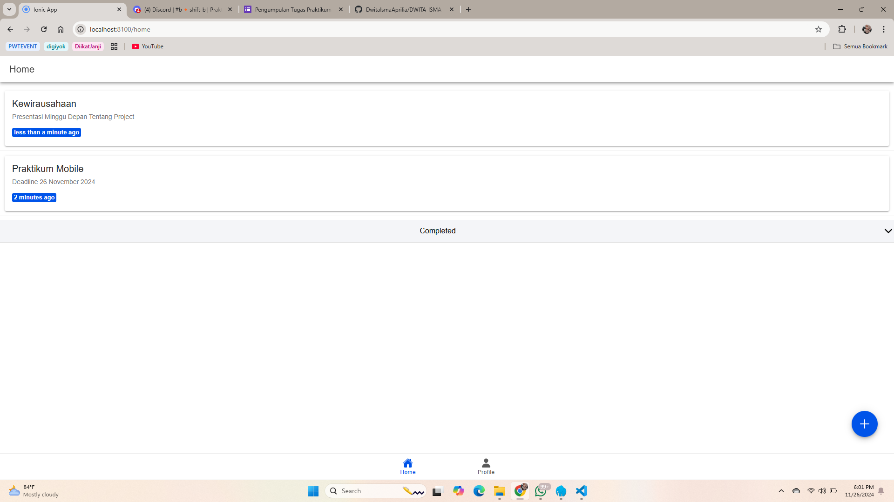

## Halaman Tampilan Awal

### 1. Proses Autentikasi Login
 Ketika pengguna menekan tombol "Sign In With Google", aplikasi memulai proses login menggunakan Firebase Authentication.
 Firebase menyediakan metode signInWithPopup atau signInWithRedirect untuk menangani autentikasi ini. **GoogleAuthProvider** digunakan untuk menghubungkan Firebase dengan layanan autentikasi Google.

## Sign In Google

### 2. Google Sign-In
 Firebase mengarahkan pengguna ke halaman login Google.
 Pengguna memasukkan kredensial akun Google mereka (email dan password) di halaman Google.
 Google memverifikasi kredensial tersebut.
 Jika berhasil, Google mengembalikan token autentikasi kepada Firebase.

## Halaman Home

### 3. Firebase Mendapatkan Informasi Pengguna
 Firebase menggunakan token dari Google untuk mendapatkan detail akun pengguna melalui metode signInWithPopup.
 Firebase menghasilkan user object, yang merupakan representasi dari data pengguna.
 Objek ini mencakup informasi penting seperti:
 displayName: Nama lengkap pengguna.
 email: Alamat email pengguna.
 photoURL: URL foto profil pengguna.
 uid: ID unik pengguna di Firebase.

## Halaman Profile

### 4. Aplikasi Mendapatkan Data Profil
 Setelah login berhasil, aplikasi menerima user object dari Firebase. Data ini langsung bisa digunakan atau disimpan untuk keperluan lain.
 Contoh data profil yang bisa diakses:
 user.displayName; // Nama lengkap pengguna
 user.email;       // Email pengguna
 user.photoURL;    // URL foto profil pengguna
 user.uid;         // ID unik pengguna

### 5. Menyimpan Status Login
 Firebase menyediakan fitur pemantauan status autentikasi menggunakan onAuthStateChanged. Dengan ini, aplikasi dapat mengetahui apakah pengguna masih dalam keadaan login atau tidak.
 Saat aplikasi dimuat ulang, status login pengguna tetap dipertahankan tanpa memerlukan login ulang, kecuali pengguna melakukan logout.

### 6. Logout
 Ketika pengguna menekan tombol "Logout", aplikasi memanggil metode signOut dari Firebase.
 Firebase akan menghapus token autentikasi pengguna, sehingga mereka tidak lagi dianggap sebagai pengguna yang login.

# CRUD
 Fitur
 Tambah (Create): Menambahkan tugas baru dengan judul dan deskripsi.
 Baca (Read): Melihat semua tugas aktif dan tugas yang telah diselesaikan dalam bagian terpisah.
 Perbarui (Update): Mengedit judul dan deskripsi tugas yang sudah ada.
 Hapus (Delete): Menghapus tugas dari daftar.
 Ubah Status: Menandai tugas sebagai selesai atau mengembalikannya menjadi aktif.

 1. Tambah (Create)
 Fungsi: handleSubmit
 Proses:
 Memvalidasi input untuk memastikan bahwa judul telah diisi.
 Memanggil metode addTodo Firestore untuk tugas baru, atau updateTodo untuk tugas yang diperbarui.
 Memperbarui UI dan menampilkan notifikasi sukses/gagal.
 Trigger: Pengiriman formulir dari komponen InputModal.

 2. Baca (Read)
 Fungsi: loadTodos
 Proses:
 Mengambil semua data tugas dari Firestore dengan menggunakan metode firestoreService.getTodos.
 Memisahkan tugas menjadi activeTodos (tugas aktif) dan completedTodos (tugas selesai) menggunakan properti terhitung (computed properties).
 Trigger: Saat aplikasi dimuat pertama kali (onMounted) atau saat pengguna menyegarkan halaman.

 3. Perbarui (Update)
 Fungsi: handleEdit dan handleSubmit
 Proses:
 Membuka modal InputModal dengan data tugas yang dipilih.
 Memperbarui data di Firestore menggunakan metode updateTodo saat formulir dikirim.
 Memuat ulang daftar tugas.
 Trigger: Klik tombol edit pada opsi geser (sliding options).

 4. Hapus (Delete)
 Fungsi: handleDelete
 Proses:
 Menghapus tugas yang dipilih dari Firestore dengan metode deleteTodo.
 Memuat ulang daftar tugas untuk mencerminkan perubahan.
 Trigger: Klik tombol hapus pada opsi geser atau menggunakan gesture geser.

 5. Ubah Status
 Fungsi: handleStatus
 Proses:
 Mengubah status tugas (aktif/sudah selesai) menggunakan metode updateStatus dari Firestore.
 Memuat ulang daftar tugas.
 Trigger: Klik tombol status atau menggunakan gesture geser.

